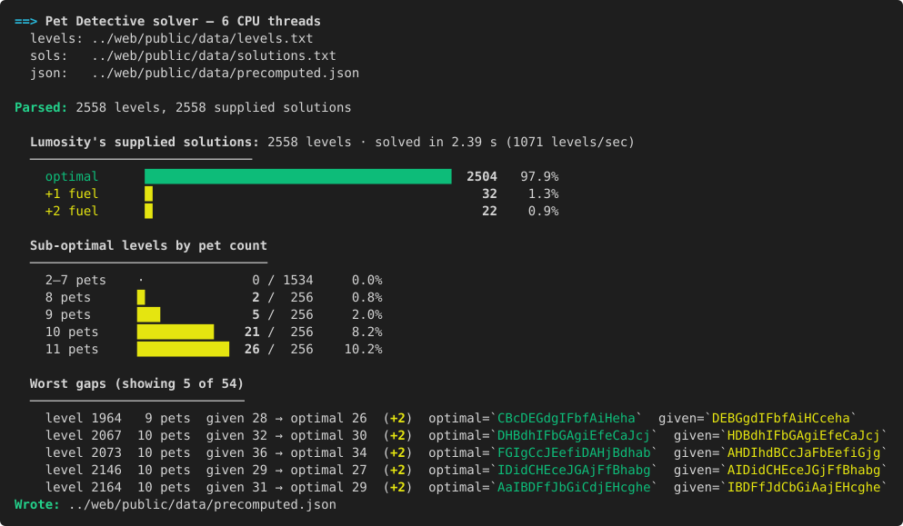

# Pet Detective Solver

Lumosity's [Pet Detective](https://www.lumosity.com/en/blog/pet-detective-behind-the-game)
is a routing puzzle: drive a four-seat car around a grid, pick up pets, drop
them at matching houses, do it in as few moves as possible. Lumosity's blog
muses that for big enough routing problems "computers couldn't even find a
solution in the lifetime of the universe." A parallel BFS in Rust disagrees
— it solves all 2,558 shipped levels in roughly two seconds.

Two pieces:

- **`rust_solver/`** — Parallel BFS solver (rayon + base-3 joint-state
  encoding + thread-local scratch buffers) that writes the optimal route for
  every level to `web/public/data/precomputed.json`.
- **`web/`** — Svelte 5 + Tailwind app with two modes:
  - **Find a level** — click pets onto an empty grid; the matcher narrows
    down which of the 2,558 shipped levels you're looking at.
  - **Solution library** — browse every level and watch its optimal route
    play out, animated step-by-step.

## Findings

Every shipped level is solvable. **2,504** of Lumosity's supplied
solutions are already optimal; the remaining **54** are sub-optimal —
**32** waste exactly one fuel and **22** waste two.

## Run locally

### Web app
```sh
cd web
npm install
npm run dev
```
Open <http://localhost:5173>.

### Rust solver
```sh
cd rust_solver
cargo run --release
```
Solves every level, prints a coloured summary, and rewrites
`../web/public/data/precomputed.json` — the file the web app fetches at
runtime. Inputs (`levels.txt`, `solutions.txt`) live in `web/public/data/`,
so no extraction step is needed.

## Example solver output



## Acknowledgements

Pet Detective and all in-game artwork are © Lumos&nbsp;Labs,&nbsp;Inc. The
level data and sprites in this repository are derived from the
publicly-distributed Lumosity Android bundle and are reused here for
research and educational purposes only. This project is unaffiliated with
Lumosity. To play the actual game, head to
[lumosity.com](https://www.lumosity.com).
